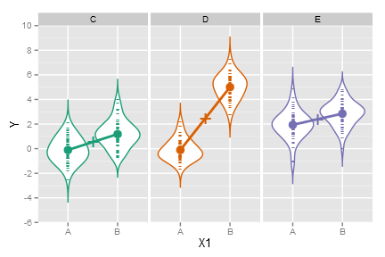
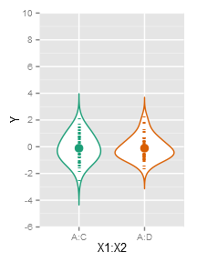
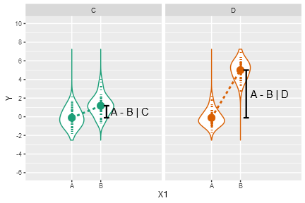
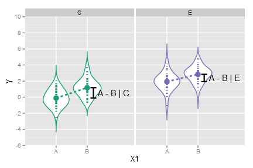
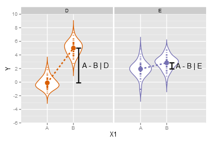

The aligned-rank transform (ART) allows for non-parametric analyses of variance. 
But how should we do contrast tests with ART? 

**Within a single factor**, contrasts in ART are straightforward: simply conduct contrasts on the linear model containing the response aligned for that factor.

**For interactions**, which necessarily involve effects across factors, what types of contrasts are valid may not be immediately obvious. This page explains what types of interaction contrasts are 
appropriate on aligned-rank-transformed (ART) data, what are not, and why.

## Contents

1. [Test Dataset](#test-dataset): Description of the test data we will use to compare a linear model against ART
2. [Contrast tests of main effects](#contrast-tests-of-main-effects): Demo of conducting contrasts within a single factor (no interaction)
3. [Tests of differences in pairwise combinations of levels between factors in interactions](#tests-of-differences-in-pairwise-combinations-of-levels-between-factors-in-interactions):
   Interaction contrasts that **are not valid** in ART 
4. [Tests of differences of differences in interactions](#tests-of-differences-of-differences-in-interactions):
   Interaction contrasts that **are valid** in ART

## Libraries needed for this


```r
library(ARTool)     #art, artlm
library(dplyr)      #data_frame, %>%, filter, etc
library(lsmeans)    #lsmeans
library(phia)       #testInteractions
library(tidyr)      #spread, gather
library(ggplot2)    #ggplot, stat_..., geom_..., etc
```


## Test dataset

Let's generate some test data where we actually know what the effects are. Specifically,


```r
n_per_group = 150
df = data_frame(
    X1 = factor(c(rep("A", n_per_group), rep("B", n_per_group))),
    X2 = factor(rep(c("C","D","E"), n_per_group*2/3)),
    Y = rnorm(n_per_group*2, 
        (X1 == "B")
        + 2* (X2 == "D")
        + 2 * (X1 == "B" & X2 == "D")
        - 2 * (X1 == "A" & X2 == "D")
        + 2 * (X2 == "E")) 
)
```

This is normally-distributed error with the same variance at all levels, so we can compare the results of ART to a linear model,
which will correctly estimate the effects.

I pre-ran the above code and saved it as `InteractionTestData` so that the text here is consistent:


```r
data("InteractionTestData")
df = InteractionTestData    #save some typing
```

The "true" means from the model look like this:

| X1 | X2       | Mean |
|:--:|:--------:|:----:|
| A  | C or D   | 0    |
| A  | E        | 2    |
| B  | C        | 1    |
| B  | D        | 5    |
| B  | E        | 3    |

Which we can see pretty well:


```r
palette = c("#1b9e77", "#d95f02", "#7570b3")
names(palette) = c("C", "D", "E")
ggplot(df, aes(x=X1, y=Y, color=X2)) + 
    geom_violin(trim=FALSE, adjust=1.5) + 
    geom_point(pch="-", size=4) +
    stat_summary(fun.y=mean, geom="point", size=4) + 
    stat_summary(fun.y=mean, geom="line", size=1, mapping=aes(group=X2)) +
    stat_summary(fun.y=mean, geom="point", size=9, mapping=aes(x=1.5, group=NA), pch="+") +
    scale_y_continuous(breaks=seq(-6,10,by=2), minor_breaks=-6:10) +
    scale_color_manual(guide=FALSE, values=palette) +
    coord_cartesian(ylim=c(-6,10)) + 
    facet_grid(. ~ X2)
```

 

And "true" means for each level (averaging over the levels of the other factor):

| Level    | Mean     |
|:--------:|:--------:|
| X1 == A  | 0.66666  |
| X1 == B  | 3        |
| X2 == C  | 0.5      |
| X2 == D  | 2.5      |
| X2 == E  | 2.5      |

Let's fit a linear model:


```r
m.linear = lm(Y ~ X1*X2, data=df)
anova(m.linear)
```

```
## Analysis of Variance Table
## 
## Response: Y
##            Df Sum Sq Mean Sq F value    Pr(>F)    
## X1          1 445.50  445.50  439.44 < 2.2e-16 ***
## X2          2 236.44  118.22  116.61 < 2.2e-16 ***
## X1:X2       2 270.40  135.20  133.36 < 2.2e-16 ***
## Residuals 294 298.06    1.01                      
## ---
## Signif. codes:  0 '***' 0.001 '**' 0.01 '*' 0.05 '.' 0.1 ' ' 1
```

Now with ART:


```r
m.art = art(Y ~ X1*X2, data=df)
anova(m.art)
```

```
## Analysis of Variance of Aligned Rank Transformed Data
## 
## Table Type: Anova Table (Type III tests) 
## Model: No Repeated Measures (lm)
## Response: art(Y)
## 
##         Df Df.res F value     Pr(>F)    
## 1 X1     1    294  488.33 < 2.22e-16 ***
## 2 X2     2    294  114.35 < 2.22e-16 ***
## 3 X1:X2  2    294  145.65 < 2.22e-16 ***
## ---
## Signif. codes:   0 '***' 0.001 '**' 0.01 '*' 0.05 '.' 0.1 ' ' 1
```

Both have significance at all levels (expected given the number of samples and the "true" effects) and similar enough F values. 
The real question is whether/what kind of contrast tests make sense.

### Contrast tests of main effects

For the main effects, let's look at contrast tests for the linear model:


```r
lsmeans(m.linear, pairwise ~ X1)$contrasts
```

```
##  contrast  estimate        SE  df t.ratio p.value
##  A - B    -2.437216 0.1162643 294 -20.963  <.0001
## 
## Results are averaged over the levels of: X2
```

```r
lsmeans(m.linear, pairwise ~ X2)$contrasts
```

```
##  contrast    estimate        SE  df t.ratio p.value
##  C - D    -1.91212883 0.1423941 294 -13.428  <.0001
##  C - E    -1.85296777 0.1423941 294 -13.013  <.0001
##  D - E     0.05916106 0.1423941 294   0.415  0.9093
## 
## Results are averaged over the levels of: X1 
## P value adjustment: tukey method for comparing a family of 3 estimates
```

These are about right: The "true" effect for `A - B` is `-2.3333`, for `C - D` and `C - E` is `-2`, and for `D - E` is `0` (see table above). From ART:


```r
lsmeans(artlm(m.art, "X1"), pairwise ~ X1)$contrasts
```

```
##  contrast  estimate       SE  df t.ratio p.value
##  A - B    -136.8133 6.191181 294 -22.098  <.0001
## 
## Results are averaged over the levels of: X2
```

```r
lsmeans(artlm(m.art, "X2"), pairwise ~ X2)$contrasts
```

```
##  contrast estimate       SE  df t.ratio p.value
##  C - D     -123.13 9.277428 294 -13.272  <.0001
##  C - E     -119.81 9.277428 294 -12.914  <.0001
##  D - E        3.32 9.277428 294   0.358  0.9319
## 
## Results are averaged over the levels of: X1 
## P value adjustment: tukey method for comparing a family of 3 estimates
```

This is about right (effects in the same direction, the estimates aren't
the same because they are on the scale of ranks and not the data, but the t values are similar to the linear model, as we should hope). 
Contrast tests of main effects seem to be consistent then.

### Tests of differences in pairwise combinations of levels between factors in interactions

Now let's look at tests of differences in combinations of levels between factors:


```r
lsmeans(m.linear, pairwise ~ X1:X2)$contrasts
```

```
##  contrast       estimate        SE  df t.ratio p.value
##  A,C - B,C -1.2901606831 0.2013757 294  -6.407  <.0001
##  A,C - A,D -0.0005062796 0.2013757 294  -0.003  1.0000
##  A,C - B,D -5.1139120652 0.2013757 294 -25.395  <.0001
##  A,C - A,E -2.0440071593 0.2013757 294 -10.150  <.0001
##  A,C - B,E -2.9520890651 0.2013757 294 -14.660  <.0001
##  B,C - A,D  1.2896544035 0.2013757 294   6.404  <.0001
##  B,C - B,D -3.8237513821 0.2013757 294 -18.988  <.0001
##  B,C - A,E -0.7538464761 0.2013757 294  -3.743  0.0030
##  B,C - B,E -1.6619283819 0.2013757 294  -8.253  <.0001
##  A,D - B,D -5.1134057856 0.2013757 294 -25.392  <.0001
##  A,D - A,E -2.0435008796 0.2013757 294 -10.148  <.0001
##  A,D - B,E -2.9515827854 0.2013757 294 -14.657  <.0001
##  B,D - A,E  3.0699049060 0.2013757 294  15.245  <.0001
##  B,D - B,E  2.1618230002 0.2013757 294  10.735  <.0001
##  A,E - B,E -0.9080819058 0.2013757 294  -4.509  0.0001
## 
## P value adjustment: tukey method for comparing a family of 6 estimates
```

And for ART:


```r
#DO NOT DO THIS!
lsmeans(artlm(m.art, "X1:X2"), pairwise ~ X1:X2)$contrasts
```

```
##  contrast  estimate       SE  df t.ratio p.value
##  A,C - B,C    76.90 12.39868 294   6.202  <.0001
##  A,C - A,D   125.12 12.39868 294  10.091  <.0001
##  A,C - B,D   -45.26 12.39868 294  -3.650  0.0042
##  A,C - A,E   -12.08 12.39868 294  -0.974  0.9258
##  A,C - B,E    87.16 12.39868 294   7.030  <.0001
##  B,C - A,D    48.22 12.39868 294   3.889  0.0017
##  B,C - B,D  -122.16 12.39868 294  -9.853  <.0001
##  B,C - A,E   -88.98 12.39868 294  -7.177  <.0001
##  B,C - B,E    10.26 12.39868 294   0.828  0.9623
##  A,D - B,D  -170.38 12.39868 294 -13.742  <.0001
##  A,D - A,E  -137.20 12.39868 294 -11.066  <.0001
##  A,D - B,E   -37.96 12.39868 294  -3.062  0.0288
##  B,D - A,E    33.18 12.39868 294   2.676  0.0832
##  B,D - B,E   132.42 12.39868 294  10.680  <.0001
##  A,E - B,E    99.24 12.39868 294   8.004  <.0001
## 
## P value adjustment: tukey method for comparing a family of 6 estimates
```

Very different results. 

The linear model tests are easy to interpret: 
they tell us the expected mean difference between combinations of levels.

The ART results are more difficult to interpret. Take `A,C - A,D`, which looks like this:


```r
df %>%
    filter(X1 == "A", X2 %in% c("C", "D")) %>%
    ggplot(aes(x=X1:X2, y=Y, color=X2)) + 
    geom_violin(trim=FALSE, adjust=1.5) + 
    geom_point(pch="-", size=4) +
    stat_summary(fun.y=mean, geom="point", size=4) + 
    scale_y_continuous(breaks=seq(-6,10,by=2), minor_breaks=-6:10) +
    scale_color_manual(guide=FALSE, values=palette) +
    coord_cartesian(ylim=c(-6,10)) 
```

 

The linear model correctly estimates this difference as `~0`, which is both the true effect and what we should expect from a visual
inspection of the data. Unlike the linear model, the ART model gives us a statistically significant difference between `A,C` and `A,D`, 
which if we interpret in the same way as the linear model is obviously incorrect.

The key here is to understand that ART is reporting differences with the main effects subtracted out.
That is, the `A,C - A,D` effect is something like the difference between this combination of levels if we first
subtracted out the effect of `C - D`. We can see this if we take the ART estimate for `C - D` in the lsmeans for `X2` above (`-123.13`) and the
ART estimate for `A,C - A,D` (`125.12`) here, we can get approximate an estimate of the difference (`-123.13 + 125.12 == 1.99`)
that is consistent with the expected 0 (given the SE here).

If we first combine the factors before aligning-and-ranking, we can get an estimate of these effects:


```r
#DO NOT DO THIS WITHOUT READING THE NOTE BELOW
df$X = with(df, X1:X2)
m.art.12 = art(Y ~ X, data=df)
lsmeans(artlm(m.art.12, "X"), pairwise ~ X)$contrasts
```

```
##  contrast  estimate       SE  df t.ratio p.value
##  A:C - A:D     1.96 8.908834 294   0.220  0.9999
##  A:C - A:E  -100.96 8.908834 294 -11.333  <.0001
##  A:C - B:C   -63.16 8.908834 294  -7.090  <.0001
##  A:C - B:D  -205.76 8.908834 294 -23.096  <.0001
##  A:C - B:E  -141.84 8.908834 294 -15.921  <.0001
##  A:D - A:E  -102.92 8.908834 294 -11.553  <.0001
##  A:D - B:C   -65.12 8.908834 294  -7.310  <.0001
##  A:D - B:D  -207.72 8.908834 294 -23.316  <.0001
##  A:D - B:E  -143.80 8.908834 294 -16.141  <.0001
##  A:E - B:C    37.80 8.908834 294   4.243  0.0004
##  A:E - B:D  -104.80 8.908834 294 -11.764  <.0001
##  A:E - B:E   -40.88 8.908834 294  -4.589  0.0001
##  B:C - B:D  -142.60 8.908834 294 -16.007  <.0001
##  B:C - B:E   -78.68 8.908834 294  -8.832  <.0001
##  B:D - B:E    63.92 8.908834 294   7.175  <.0001
## 
## P value adjustment: tukey method for comparing a family of 6 estimates
```

Note that the above table is not in the same order as the previous ones, but does have similar t values to the corresponding effects
from the linear model. __However, it is not clear this will generalize.__ In this case there aren't any other factors except these two, 
so this is equivalent to just ranking the response before fitting the model, and in the general case it can incorrectly estimate 
interactions (see issues with using the plain-old rank transform in the ART literature, specifically Higgins' papers). Thus, I 
can't recommended this approach in the general case (or at least, not without more investigation).

### Tests of _differences of differences_ in interactions

While tests of differences of combinations of levels between factors have issues in ART, we can test _differences of differences_; e.g., 
for the interaction `X1:X2`, we might ask, is the difference `A - B` different when `X2 = C` compared to when `X2 = D`? We
can test this using the `testInteractions` function from package `phia`.

Before we test, let's try to visualize what's going on in just this interaction:


```r
plot_interaction_for_X2_levels = function(...) {
    x2_levels = c(...)
    df. = filter(df, X2 %in% x2_levels)
    X1_in_X2 = df. %>%
        group_by(X1, X2) %>%
        summarise(Y = mean(Y)) %>%
        spread(X1, Y)
    print(ggplot(df., aes(x=X1, y=Y, color=X2)) +  
        geom_violin(trim=FALSE, adjust=1.5) + 
        geom_point(pch="-", size=4) +
        stat_summary(fun.y=mean, geom="point", size=4) + 
        stat_summary(fun.y=mean, geom="line", size=1, mapping=aes(group=X2), linetype="dashed") +
        geom_errorbar(aes(x=2.2, ymin=A, ymax=B, y=0), 
            data=X1_in_X2, width=.19, size=0.8, color="black") +
        geom_text(aes(x=2.35, y=(A + B)/2, label=paste("A - B |", X2)), 
            data=X1_in_X2, hjust=0, size=5, color="black") +
        scale_y_continuous(breaks=seq(-6,10,by=2), minor_breaks=-6:10) +
        scale_color_manual(guide=FALSE, values=palette[x2_levels]) + 
        coord_cartesian(xlim=c(0, 3.5), ylim=c(-6,10)) +
        facet_grid(. ~ X2))
}
plot_interaction_for_X2_levels("C", "D")
```

 

The true effect for `A - B | C` is -1, for `A - B | D` is -5, and for `(A - B | C) - (A - B | D)` is `(-1) - (-5) = 4`.
Visually, we're asking if the two dashed lines in the above plot are parallel. Equivalently, we're asking if the vertical distance from the mean of
A to the mean of B in the left panel (when X2 == C) is the same as the vertical distance between A and B in the right panel (when X2 == D).
The true difference between these vertical distances (the "difference of a difference") is 4, which is also about what we would estimate
it to be by looking at the above plot.

We can get the estimate of this "difference of a difference" from the linear model:


```r
#unfortunately, the meaning of "pairwise" here isn't the same as how lsmeans
#uses it when multiple factors are involved --- here we get differences of differences.
testInteractions(m.linear, pairwise=c("X1", "X2"))
```

```
## F Test: 
## P-value adjustment method: holm
##             Value  Df Sum of Sq      F Pr(>F)    
## A-B : C-D  3.8232   1   182.715 180.23 <2e-16 ***
## A-B : C-E -0.3821   1     1.825   1.80 0.1808    
## A-B : D-E -4.2053   1   221.059 218.05 <2e-16 ***
## Residuals         294   298.059                  
## ---
## Signif. codes:  0 '***' 0.001 '**' 0.01 '*' 0.05 '.' 0.1 ' ' 1
```

Here we can interpret the row `A-B : C-D` as the difference between (`A-B | C`) and (`A-B | D`), which
is estimated as `3.82` (close to the true effect of 4, see the plot above). 

We can look at a similar plot for `A-B : C-E`:


```r
plot_interaction_for_X2_levels("C", "E")
```

 

Here the true effect for `A - B | C` is -1, `A - B | E` is also -1, and `(A - B | C) - (A - B | E)` is `0`.
Visually, this sample looks close to the true effects (the height of `A - B | C` is about the same as `A - B | E`). 
From the the row `A-B : C-E` above we can see that the 
estimate from the linear model is ~0, as we should hope.

A similar visual analysis finds the estimate for `A-B : D-E` (~ -4.2) also to be correct (true effect is -4):


```r
plot_interaction_for_X2_levels("D", "E")
```

 

Now we look at these differences of differences in art:


```r
testInteractions(artlm(m.art, "X1:X2"), pairwise=c("X1", "X2"))
```

```
## F Test: 
## P-value adjustment method: holm
##             Value  Df Sum of Sq        F Pr(>F)    
## A-B : C-D  247.28   1    764342 198.8827 <2e-16 ***
## A-B : C-E  -22.34   1      6238   1.6232 0.2036    
## A-B : D-E -269.62   1    908687 236.4412 <2e-16 ***
## Residuals         294   1129896                    
## ---
## Signif. codes:  0 '***' 0.001 '**' 0.01 '*' 0.05 '.' 0.1 ' ' 1
```

And we see F values consistent with the linear model and the same effect directions. These types of comparisons work under ART because they
do not involve coefficients of main effects (see the description of these tests in 
[this phia vignette](https://cran.r-project.org/web/packages/phia/vignettes/phia.pdf)), thus are consistent even when we've
stripped out the main effects.
