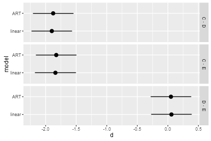

## Introduction

The aligned-rank transform (ART) allows for non-parametric analyses of variance. 
But how do we derive effect sizes from ART results? 

## Contents

1. [Test Dataset](#test-dataset): The test data we will use to compare a linear model against ART
1. [Partial eta-squared](#partial-eta-squared): Calculation of partial eta-squared (effect size for F tests)
1. [Cohen's d](#cohens-d): Calculation of standardized mean differences (Cohen's d; effect size for t tests), including confidence intervals

## Libraries needed for this


```r
library(ARTool)     #art, artlm
library(dplyr)      #data_frame, %>%, filter, etc
library(lsmeans)    #lsmeans
library(phia)       #testInteractions
library(tidyr)      #spread, gather
library(ggplot2)    #ggplot, stat_..., geom_..., etc
library(DescTools)  #EtaSq
library(car)        #sigmaHat
```


## Test dataset

Let's load the test dataset from `vignette("art-contrasts")`:


```r
data(InteractionTestData)
df = InteractionTestData    #save some typing
```

Let's fit a linear model:


```r
#we'll be doing type 3 tests, so we want sum-to-zero contrasts
options(contrasts = c("contr.sum", "contr.poly"))
m.linear = lm(Y ~ X1*X2, data=df)
```

Now with ART:


```r
m.art = art(Y ~ X1*X2, data=df)
```


## Partial eta-squared

Note that for Fixed-effects-only models and repeated measures models
(those with `Error()` terms) ARTool also collects the sums of squares, but
does not print them by default. We can pass `verbose = TRUE` to `print()`
to print them:


```r
m.art.anova = anova(m.art)
print(m.art.anova, verbose=TRUE)
```

```
## Analysis of Variance of Aligned Rank Transformed Data
## 
## Table Type: Anova Table (Type III tests) 
## Model: No Repeated Measures (lm)
## Response: art(Y)
## 
##         Df Df.res  Sum Sq Sum Sq.res F value     Pr(>F)    
## 1 X1     1    294 1403842     845192  488.33 < 2.22e-16 ***
## 2 X2     2    294  984215    1265239  114.35 < 2.22e-16 ***
## 3 X1:X2  2    294 1119512    1129896  145.65 < 2.22e-16 ***
## ---
## Signif. codes:   0 '***' 0.001 '**' 0.01 '*' 0.05 '.' 0.1 ' ' 1
```

We can use the sums of squares to calculate partial eta-squared:


```r
m.art.anova$eta.sq.part = with(m.art.anova, `Sum Sq`/(`Sum Sq` + `Sum Sq.res`))
m.art.anova
```

```
## Analysis of Variance of Aligned Rank Transformed Data
## 
## Table Type: Anova Table (Type III tests) 
## Model: No Repeated Measures (lm)
## Response: art(Y)
## 
##         Df Df.res F value     Pr(>F) eta.sq.part    
## 1 X1     1    294  488.33 < 2.22e-16     0.62420 ***
## 2 X2     2    294  114.35 < 2.22e-16     0.43754 ***
## 3 X1:X2  2    294  145.65 < 2.22e-16     0.49769 ***
## ---
## Signif. codes:   0 '***' 0.001 '**' 0.01 '*' 0.05 '.' 0.1 ' ' 1
```

We can compare the above results to partial eta-squared calculated on the
linear model (the second column below):


```r
EtaSq(m.linear, type=3)
```

```
##          eta.sq eta.sq.part
## X1    0.3562872   0.5991468
## X2    0.1890921   0.4423595
## X1:X2 0.2162503   0.4756719
```

The results are comparable.


## Cohen's d

We can derive Cohen's d (the standardized mean difference) by dividing estimated differences by the
residual standard deviation of the model. Note that this relies somewhat on the assumption of 
constant variance across levels (aka homoscedasticity).

### in the linear model (for comparison)

As a comparison, let's first derive pairwise contrasts for
all levels of X2 in the linear model:


```r
x2.contrasts = summary(pairs(lsmeans(m.linear, ~ X2)))
```

```
## NOTE: Results may be misleading due to involvement in interactions
```

Then divide these estimates by the residual standard deviation to get an estimate of d:


```r
x2.contrasts$d = x2.contrasts$estimate / sigmaHat(m.linear)
x2.contrasts
```

```
##  contrast    estimate        SE  df t.ratio p.value          d
##  C - D    -1.91212883 0.1423941 294 -13.428  <.0001 -1.8990660
##  C - E    -1.85296777 0.1423941 294 -13.013  <.0001 -1.8403091
##  D - E     0.05916106 0.1423941 294   0.415  0.9093  0.0587569
## 
## Results are averaged over the levels of: X1 
## P value adjustment: tukey method for comparing a family of 3 estimates
```

Note that this is essentially the same as the unstandardized estimate for this model;
that is because this test dataset was generated with a residual standard deviation of 1.

### in ART

We can follow the same procedure on the ART model for factor X2:


```r
m.art.x2 = artlm(m.art, "X2")
x2.contrasts.art = summary(pairs(lsmeans(m.art.x2, ~ X2)))
```

```
## NOTE: Results may be misleading due to involvement in interactions
```

```r
x2.contrasts.art$d = x2.contrasts.art$estimate / sigmaHat(m.art.x2)
x2.contrasts.art
```

```
##  contrast estimate       SE  df t.ratio p.value           d
##  C - D     -123.13 9.277428 294 -13.272  <.0001 -1.87694379
##  C - E     -119.81 9.277428 294 -12.914  <.0001 -1.82633505
##  D - E        3.32 9.277428 294   0.358  0.9319  0.05060873
## 
## Results are averaged over the levels of: X1 
## P value adjustment: tukey method for comparing a family of 3 estimates
```

Note how standardization is helping us now: The standardized mean differences (d) are
quite similar to the estimates of d from the linear model above.

## Confidence intervals

We can also derive confidence intervals on these effect sizes. From the linear model:


```r
x2.contrasts.ci = confint(pairs(lsmeans(m.linear, ~ X2)))
```

```
## NOTE: Results may be misleading due to involvement in interactions
```

```r
x2.contrasts.ci = within(x2.contrasts.ci, {
    d.upper.CL = upper.CL / sigmaHat(m.linear)
    d.lower.CL = lower.CL / sigmaHat(m.linear)
    d = estimate / sigmaHat(m.linear)
})
x2.contrasts.ci
```

```
##  contrast    estimate        SE  df   lower.CL   upper.CL          d
##  C - D    -1.91212883 0.1423941 294 -2.2475590 -1.5766987 -1.8990660
##  C - E    -1.85296777 0.1423941 294 -2.1883979 -1.5175376 -1.8403091
##  D - E     0.05916106 0.1423941 294 -0.2762691  0.3945912  0.0587569
##  d.lower.CL d.upper.CL
##  -2.2322046 -1.5659274
##  -2.1734478 -1.5071705
##  -0.2743817  0.3918955
## 
## Results are averaged over the levels of: X1 
## Confidence level used: 0.95 
## Conf-level adjustment: tukey method for comparing a family of 3 estimates
```

And from the ART model:


```r
x2.contrasts.art.ci = confint(pairs(lsmeans(m.art.x2, ~ X2)))
```

```
## NOTE: Results may be misleading due to involvement in interactions
```

```r
x2.contrasts.art.ci = within(x2.contrasts.art.ci, {
    d.upper.CL = upper.CL / sigmaHat(m.art.x2)
    d.lower.CL = lower.CL / sigmaHat(m.art.x2)
    d = estimate / sigmaHat(m.art.x2)
})
x2.contrasts.art.ci
```

```
##  contrast estimate       SE  df   lower.CL   upper.CL           d
##  C - D     -123.13 9.277428 294 -144.98434 -101.27566 -1.87694379
##  C - E     -119.81 9.277428 294 -141.66434  -97.95566 -1.82633505
##  D - E        3.32 9.277428 294  -18.53434   25.17434  0.05060873
##  d.lower.CL d.upper.CL
##  -2.2100824 -1.5438051
##  -2.1594737 -1.4931964
##  -0.2825299  0.3837474
## 
## Results are averaged over the levels of: X1 
## Confidence level used: 0.95 
## Conf-level adjustment: tukey method for comparing a family of 3 estimates
```

And plotting both, to compare:


```r
rbind(
        cbind(x2.contrasts.ci, model="linear"), 
        cbind(x2.contrasts.art.ci, model="ART")
    ) %>%
    ggplot(aes(x=model, y=d, ymin=d.lower.CL, ymax=d.upper.CL)) +
    geom_pointrange() +
    facet_grid(contrast ~ .) + 
    coord_flip()
```


